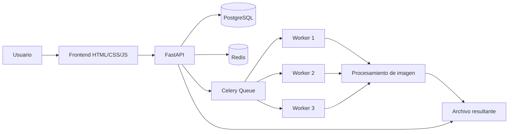

# Procesador de Imágenes

Aplicación web para subir una imagen, enviarla a una cola de procesamiento asíncrono y descargar el resultado cuando termina. El proyecto combina FastAPI, Celery, Redis, PostgreSQL y una interfaz web simple servida desde el propio backend.

## Características

- Subida de imágenes desde el navegador.
- Procesamiento asíncrono con Celery.
- Seguimiento del estado de la tarea en tiempo real mediante SSE.
- Descarga del archivo procesado al finalizar.
- Persistencia de tareas en PostgreSQL.
- Soporte para procesamiento en contenedor con Docker Compose.

## Arquitectura



## Tecnologías

- Backend: FastAPI
- Tareas asíncronas: Celery
- Cola/broker: Redis
- Base de datos: PostgreSQL
- Procesamiento de imágenes: Pillow
- Frontend: HTML, CSS y JavaScript vanilla
- Despliegue: Docker y Docker Compose

## Estructura del proyecto

```text
Backend/
	main.py            # Punto de entrada de FastAPI
	config.py          # Configuración de entorno
	database.py        # Conexión y sesión de BD
	models.py          # Modelo Task y enums
	schemas.py         # Schemas Pydantic
	tasks.py           # Tarea Celery
	routes/            # Endpoints API
	utils/image_processor.py  # Lógica de manipulación de imágenes
Frontend/
	index.html         # Interfaz web
	app.js             # Lógica de subida y seguimiento
	styles.css         # Estilos
docker-compose.yml   # PostgreSQL, Redis, backend y workers
```

## Funcionalidad de procesamiento

La interfaz actual permite estas acciones:

- Redimensionar a 800x600.
- Aplicar filtro grayscale.
- Crear miniaturas de 200 px.
- Convertir el formato a PNG, JPG, WEBP, BMP o TIFF.

El motor de procesamiento también contempla filtros adicionales en el backend, como blur, sharpen, brightness y contrast, aunque la UI actual expone solo grayscale.

## Requisitos

- Docker y Docker Compose.
- O, para ejecución local, Python 3.11+.
- PostgreSQL y Redis si no se usa Docker.

## Instalación y ejecución con Docker

1. Clona el repositorio.
2. Desde la raíz del proyecto, levanta los servicios:

```bash
docker compose up --build
```

3. Abre la aplicación en:

```text
http://localhost:8000
```

El `docker-compose.yml` levanta:

- PostgreSQL en el puerto `5432`.
- Redis en el puerto `6379`.
- El backend FastAPI en el puerto `8000`.
- Tres workers de Celery para procesar tareas en paralelo.

## Ejecución local sin Docker

Si prefieres correr el backend manualmente:

1. Crea y activa un entorno virtual.
2. Instala dependencias:

```bash
pip install -r Backend/requirements.txt
```

3. Configura estas variables de entorno, o un archivo `.env`:

- `DATABASE_URL`
- `REDIS_URL`
- `CELERY_BROKER_URL`
- `CELERY_RESULT_BACKEND`
- `DEBUG`

4. Ejecuta la API desde la carpeta `Backend/`:

```bash
uvicorn main:app --host 0.0.0.0 --port 8000 --reload
```

5. Inicia al menos un worker de Celery:

```bash
celery -A tasks.celery worker --loglevel=info
```

## Uso

1. Abre la web en `http://localhost:8000`.
2. Selecciona una imagen compatible.
3. Elige el tipo de procesamiento.
4. Envía la tarea.
5. Observa el estado hasta que aparezca el resultado.
6. Descarga la imagen procesada.

## API

### Estado general

- `GET /api`
- `GET /health`

### Subida de imagen

- `POST /api/upload/`

Parámetros del formulario:

- `file`: archivo de imagen.
- `process_type`: `redimensionar`, `convertir`, `filtro` o `miniatura`.
- `parameters`: JSON en cadena con parámetros adicionales.

Respuesta típica:

```json
{
	"task_id": "uuid-de-la-tarea",
	"status": "pendiente",
	"message": "Tarea creada. Procesando..."
}
```

### Consulta de tarea

- `GET /api/upload/{task_id}`
- `GET /api/status/{task_id}`

### Stream de estado en tiempo real

- `GET /api/status/{task_id}/stream`

Este endpoint usa Server-Sent Events para notificar cambios de estado como:

- `pendiente`
- `en_proceso`
- `completada`
- `error`

### Resultado

- `GET /api/results/{task_id}`
- `GET /api/results/{task_id}/info`

## Reglas de validación

- Tipos de archivo permitidos: `image/jpeg`, `image/png`, `image/gif`, `image/webp`.
- Tamaño máximo por archivo: 10 MB.

## Flujo interno

1. El frontend envía la imagen a `POST /api/upload/`.
2. FastAPI guarda el archivo original y crea una tarea en PostgreSQL.
3. La tarea se envía a Celery a través de Redis.
4. Un worker procesa la imagen con Pillow.
5. El estado de la tarea se actualiza en la base de datos.
6. El frontend escucha el progreso por SSE.
7. Cuando finaliza, el usuario descarga el archivo resultante.

## Variables de entorno

| Variable | Descripción |
| --- | --- |
| `DATABASE_URL` | Cadena de conexión a PostgreSQL |
| `REDIS_URL` | URL de Redis |
| `CELERY_BROKER_URL` | Broker de Celery |
| `CELERY_RESULT_BACKEND` | Backend de resultados de Celery |
| `DEBUG` | Activa modo debug en FastAPI |

## Notas

- El backend crea automáticamente las tablas al arrancar.
- Las carpetas de subida y resultados se crean también al inicio.
- El frontend se sirve desde el mismo backend cuando existe la carpeta montada en `/frontend`.
